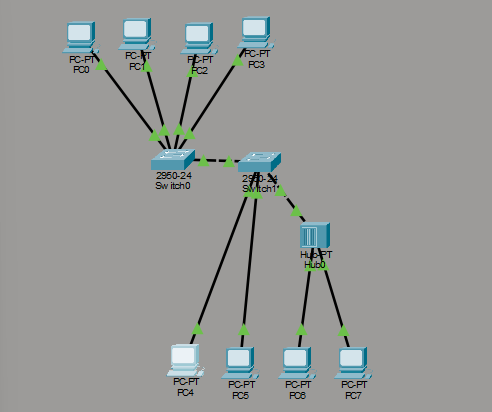
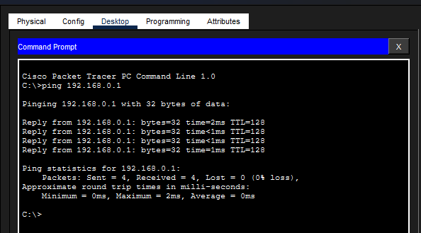
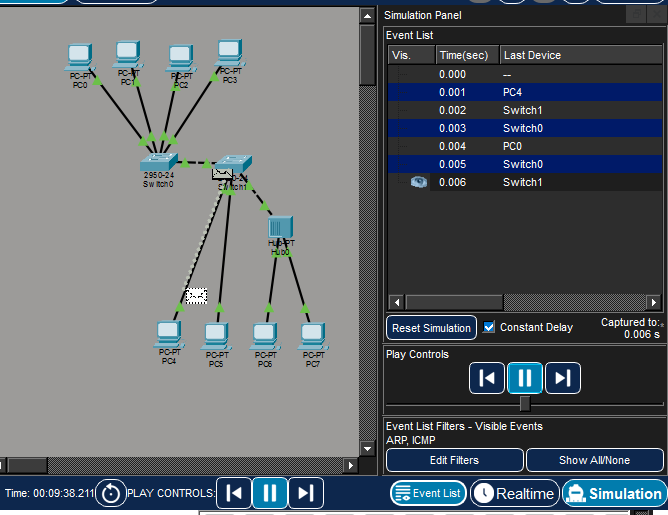

# Лабораторная работа: Сеть из 8 ПК, 2 коммутаторов и 1 хаба

## Цель
Построить локальную сеть в Cisco Packet Tracer и проверить связность
с помощью ping и режима симуляции.

## Оборудование
- 8 × PC-PT
- 2 × Switch 2950-24
- 1 × Hub-PT

## IP-адресация
| Устройство | IP | Маска |
|---|---|---|
| PC1 | 192.168.0.1 | 255.255.255.0 |
| PC2 | 192.168.0.2 | 255.255.255.0 |
| PC3 | 192.168.0.3 | 255.255.255.0 |
| PC4 | 192.168.0.4 | 255.255.255.0 |
| PC5 | 192.168.0.5 | 255.255.255.0 |
| PC6 | 192.168.0.6 | 255.255.255.0 |
| PC7 | 192.168.0.7 | 255.255.255.0 |
| PC8 | 192.168.0.8 | 255.255.255.0 |

## Соединения
- PC → Switch/Hub: Медь прямое
- Switch → Switch: Медь кроссовер
- Switch → Hub: Медь кроссовер

## Результаты
- Ping PC5 → PC1: успешно, 0% потерь
- Симуляция ICMP: пакет проходит Хаб → Switch 2 → Switch 1 → PC1

## Скриншоты

### 1. Схема сети

### 2. Консольный ping

### 3. Режим симуляции

## Использование ИИ
Воспользовался нейросетью, чтобы создать красивый и понятный README.md и для создания ссылок на скриншоты.